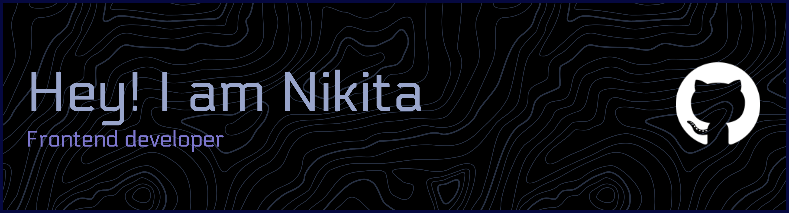

## Current Focus
### 🔭 Working on
- [FoodWishSwipe](https://github.com/nikitor141/FoodWishSwipe) 

### 🌱 Learning

## Tech Stack
### Core

### Frontend Ecosystem

### Tooling & Quality

### Also Experienced With

## 🌐 Socials

## My posts
[Используем REM для адаптива: комфортная резиновая вёрстка для всех устройств](https://habr.com/ru/articles/819565/)

